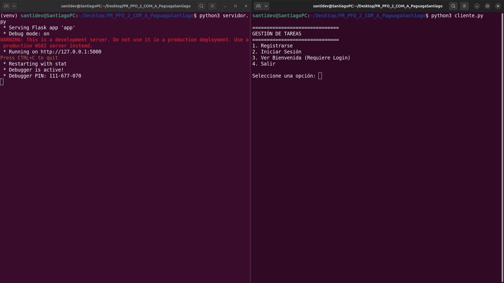
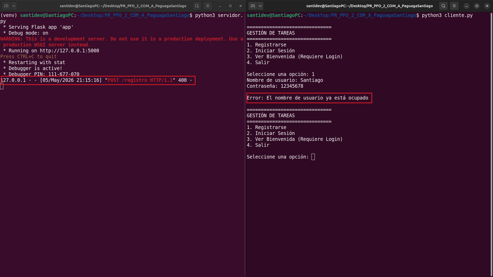
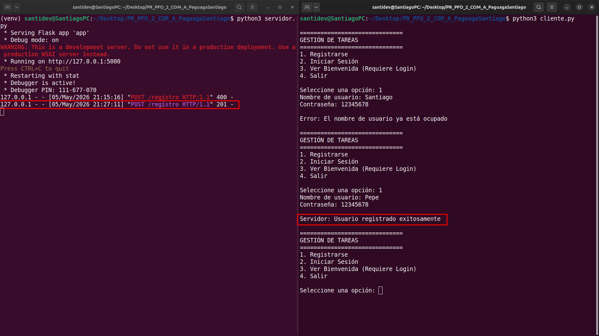
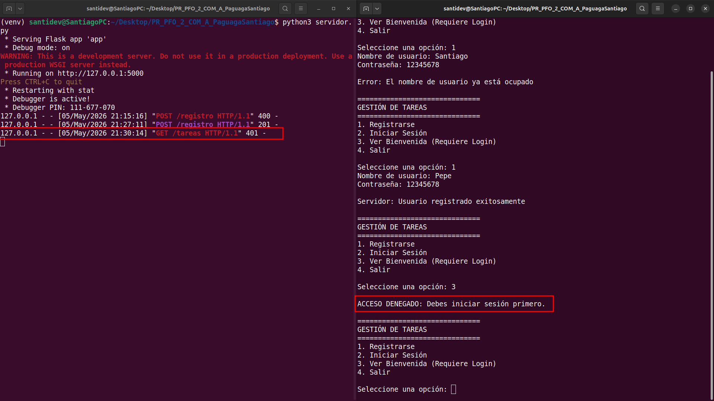
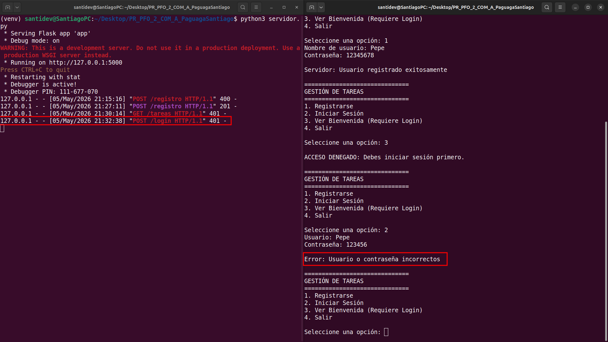
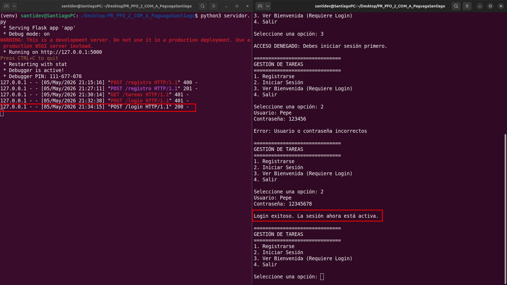
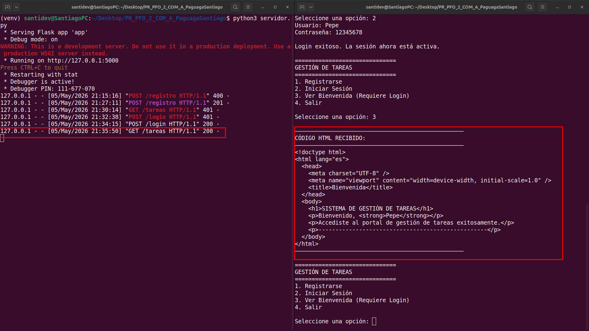
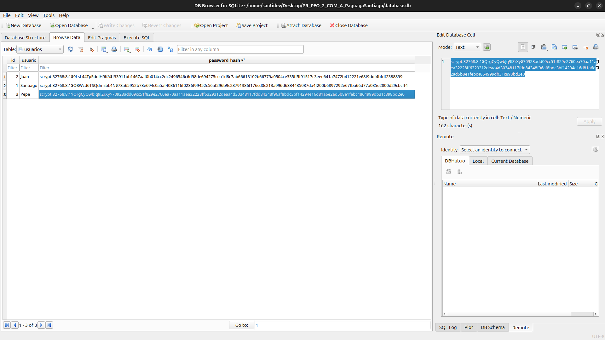

# PFO 2: Sistema de Gestión de Tareas con API y Base de Datos

## Descripción

Este proyecto consiste en la implementación de una API REST funcional para la gestión de tareas. El sistema permite el registro de usuarios y el inicio de sesión mediante autenticación protegida.

Para cumplir con los requisitos de entrega, el proyecto cuenta con una arquitectura híbrida:

- **Entorno Local:** Un servidor Flask y un cliente de consola para interactuar con la API.
- **Entorno Cloud:** Frontend alojado en **GitHub Pages** conectado a un backend en una **VPS de Oracle Cloud** mediante Docker, Nginx y certificados SSL (Certbot) para garantizar una comunicación segura (HTTPS).

## Tecnologías utilizadas

- **Python 3 / Flask:** Para la creación de la API REST.
- **SQLite:** Para la gestión de datos persistentes.
- **Librería de Hashing:** Para proteger las contraseñas de los usuarios (werkzeug.security).
- **Docker & Docker Compose:** Para la orquestación del servidor en la nube.
- **Nginx & Certbot:** Como proxy inverso y gestor de certificados SSL.
- **GitHub Pages:** Para el despliegue de la interfaz web estática.

## Cómo ejecutar el proyecto

### 1. Ejecución Local (Consola)

Para probar el funcionamiento básico solicitado:

1. Clonar el repositorio e instalar las dependencias:
   ```bash
   pip install -r requirements.txt
   ```
2. Ejecutar el servidor en una terminal:
   ```bash
   python3 servidor.py
   ```
3. Ejecutar el cliente en otra terminal::
   ```bash
   python3 cliente.py
   ```

### 2. Interacción Web: si prefieres probarlo directamente desde github pages

El proyecto está disponible de forma visual a través del siguiente enlace:

Frontend: [https://santiagonoelpaguaga.github.io/programacion-sobre-redes-pfo-2/]

El backend procesa las solicitudes de registro y login desde una VPS segura.

## Prueba de funcionamiento

### Inicialización del Sistema en Consola



En esta captura se observa el arranque inicial de los componentes del entorno local. En la terminal izquierda, se visualiza la ejecución del script servidor.py, el cual levanta la API Flask en el puerto 5000 para procesar las solicitudes. En la terminal derecha, se muestra el inicio del cliente.py, el cual despliega el menú principal para que el usuario pueda interactuar con los endpoints de registro, inicio de sesión y gestión de tareas definidos en el proyecto.

### Validación de Registro e Integridad de Datos



En esta captura se demuestra la capacidad de la API para gestionar errores y mantener la integridad de la base de datos en el endpoint POST/registro. Al intentar dar de alta un usuario cuyo nombre ya se encuentra almacenado de forma persistente en SQLite, el servidor responde con un código de estado HTTP 400 (Bad Request). Como se observa en la terminal derecha, el cliente procesa correctamente esta respuesta y notifica al usuario que "el nombre de usuario ya está ocupado", validando así el control de registros duplicados en el backend.

### Registro Exitoso de Usuario



En esta captura se observa el proceso de registro exitoso de un nuevo usuario a través del endpoint POST/registro. Al ingresar credenciales válidas y un nombre de usuario no existente (en este caso, "Pepe"), el servidor procesa la solicitud y devuelve un código de estado HTTP 201 (Created), confirmando la creación del nuevo recurso. Este procedimiento asegura la persistencia de los datos en la base de datos SQLite, donde la contraseña se almacena de forma segura mediante una técnica de hasheo, cumpliendo con los estándares de seguridad solicitados en el proyecto.

### Protección de Rutas y Acceso Denegado (401)



En esta captura se demuestra la implementación de seguridad en la gestión de tareas mediante la protección de endpoints sensibles. Al intentar acceder al recurso GET/tareas sin haber validado las credenciales previamente, el servidor responde con un código de estado HTTP 401 (Unauthorized). Como se observa en la terminal del cliente (derecha), el sistema bloquea el acceso y notifica que es necesario iniciar sesión primero, garantizando que solo los usuarios autenticados puedan visualizar el contenido protegido.

### Intento de Inicio de Sesión Fallido (Credenciales Incorrectas)



En esta captura se observa el comportamiento del sistema ante un intento de inicio de sesión con credenciales inválidas a través del endpoint POST/login. El servidor verifica la información proporcionada contra los registros almacenados en SQLite y, al no coincidir con el hash correspondiente, devuelve un código HTTP 401 (Unauthorized). En la terminal del cliente se visualiza el mensaje de error indicando que los datos son incorrectos, demostrando que el acceso a las tareas permanece restringido hasta que la autenticación sea exitosa.

### Inicio de Sesión Exitoso (200 OK)



En esta captura se documenta el proceso de autenticación exitosa mediante el endpoint POST/login. Al proporcionar las credenciales correctas, el servidor realiza la verificación correspondiente y devuelve un código de estado HTTP 200 (OK). Este paso es fundamental para cumplir con el requisito de utilizar autenticación básica protegida , permitiendo que el sistema genere una sesión activa para el usuario y habilite el acceso posterior a la gestión de tareas.

### Acceso Autorizado y Visualización de Bienvenida (200 OK)



En esta captura final del entorno de consola, se observa el acceso exitoso al endpoint GET/tareas. Una vez que el inicio de sesión ha sido verificado satisfactoriamente , el servidor permite la entrada al recurso protegido, respondiendo con un código HTTP 200 (OK) y el código fuente HTML de bienvenida. Como se muestra en la terminal derecha, el cliente recibe y despliega el contenido HTML dirigido al usuario "Pepe", lo que confirma el cumplimiento total de los requisitos funcionales de gestión de sesiones y entrega de contenido dinámico establecidos para el servidor.

### Persistencia y Seguridad en la Base de Datos



Esta captura evidencia el cumplimiento de los requisitos técnicos de seguridad y persistencia del proyecto. A través de la herramienta DB Browser for SQLite, se visualiza el contenido de la tabla de usuarios, destacando la columna password_hash. Como se observa, las credenciales no se almacenan en texto plano, sino mediante un hash irreversible generado por una librería de seguridad, garantizando la protección de los datos sensibles en el archivo de base de datos.

## Respuestas Conceptuales

### ¿Por qué hashear contraseñas?

Las contraseñas deben almacenarse hasheadas porque el hash es una función unidireccional que protege la información sensible. Si la base de datos fuera vulnerada, el atacante solo encontraría cadenas ilegibles, evitando que las contraseñas originales en texto plano sean expuestas.

### Ventajas de usar SQLite en este proyecto

- **Persistencia Directa**: Permite gestionar datos de forma persistente en un único archivo.
- **Sin Configuración**: No requiere un motor de base de datos externo, lo que facilita el despliegue rápido y la portabilidad del código fuente.

---

**Santiago Noel Paguaga** - Programación sobre Redes
